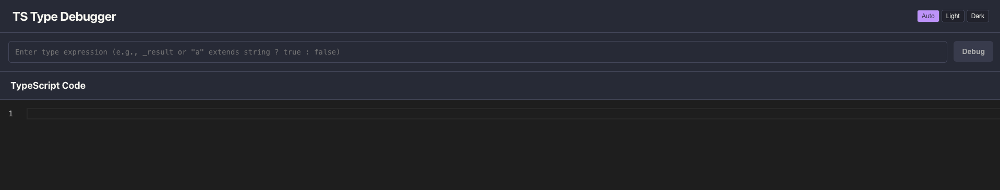

# TypeScript Type Debugger

[](https://github.com/adrianbrowning/ts-type-debugger/actions)
[](https://github.com/adrianbrowning/ts-type-debugger/actions)

[](LICENSE)
[](https://www.typescriptlang.org/)
[](CONTRIBUTING.md)

Interactive visualization tool that shows how TypeScript types resolve step-by-step. Debug complex generics, conditionals, template literals, and union distributions by watching the type system evaluate in real-time.

**[Try it live at ts-debugger.io](https://ts-debugger.io)**

<!-- TODO: Add screenshot or GIF here -->



## Features

- **Step-by-step type evaluation** - Watch types resolve one step at a time
- **Union distribution** - See how unions distribute over conditionals with `never` reduction
- **Template literal evaluation** - Visualize string template type cartesian products
- **Conditional type branching** - Follow the true/false paths through conditional types
- **Timeline playback** - Scrub through evaluation steps with playback controls
- **URL sharing** - Share type evaluations via compressed URLs (Cmd/Ctrl+S)
- **Monaco editor** - Full TypeScript editor with syntax highlighting

## Quick Start

### Use Online

Visit **[ts-debugger.io](https://ts-debugger.io)** - no installation required.

### Run Locally

```bash
git clone https://github.com/adrianbrowning/ts-type-debugger.git
cd ts-type-debugger
pnpm install
pnpm dev
```

Open http://localhost:5173

## Usage

1. **Enter TypeScript code** in the left editor panel
2. **Type the name** of the type you want to debug (e.g., `MyType<"a" | "b">`)
3. **Click Debug** to generate the evaluation trace
4. **Use the timeline** to step through each evaluation stage
5. **Watch the highlight** follow the code being evaluated
6. **Share via URL** with Cmd/Ctrl+S

### Example

```typescript
type Loop<T> = T extends "a" ? 1 : T extends "b" ? 2 : never;
type Result = Loop<"a" | "b" | "c">;
```

Debug `Result` to see:
- `"a"` evaluates to `1`
- `"b"` evaluates to `2`
- `"c"` evaluates to `never`
- Union reduces: `1 | 2 | never` → `1 | 2`

## How It Works

1. **Parse** - TypeScript Compiler API parses your code into an AST
2. **Trace** - Custom evaluator walks through type resolution, recording each step
3. **Visualize** - React renders the trace as an interactive timeline with code highlighting

## Contributing

Contributions welcome! Please:

1. Fork the repository
2. Create a feature branch (`git checkout -b feature/amazing-feature`)
3. Make your changes
4. Run tests and linting:
   ```bash
   pnpm test          # Unit & integration tests
   pnpm test:e2e      # Browser tests
   pnpm lint          # Type check & ESLint
   ```
5. Commit and push
6. Open a Pull Request

## Tech Stack

- **TypeScript** - Language & compiler API for AST parsing
- **React** - UI framework
- **Vite** - Build tool & dev server
- **Monaco Editor** - Code editor component
- **Shiki** - Syntax highlighting
- **Vitest** - Unit testing
- **Playwright** - E2E testing

## License

MIT - see [LICENSE](LICENSE) for details.
